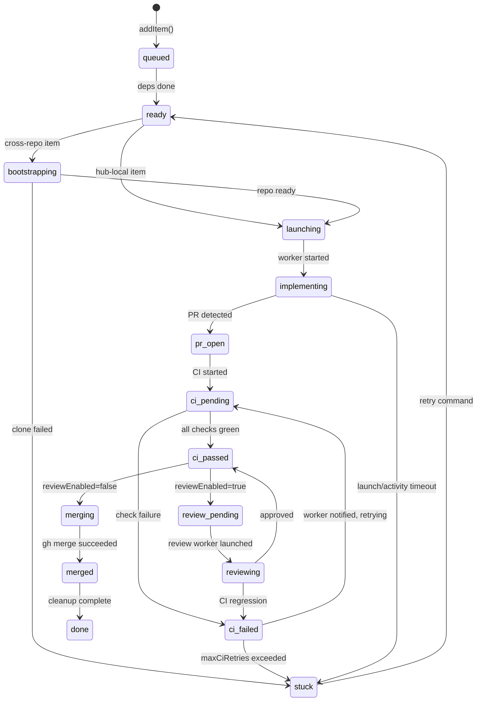

# ninthwave Architecture

A reference for contributors who want to understand how the pieces fit together before diving into code.

See also: [CONTRIBUTING.md](CONTRIBUTING.md) for development setup and coding conventions.

---

## Table of Contents

1. [Orchestrator State Machine](#orchestrator-state-machine)
2. [Data Flow](#data-flow)
3. [Key Abstractions](#key-abstractions)
4. [Extension Points](#extension-points)
5. [Supervisor Architecture](#supervisor-architecture)
6. [Worker Lifecycle](#worker-lifecycle)
7. [Sandbox Tiers](#sandbox-tiers)

---

## Orchestrator State Machine

Each TODO item moves through a state machine defined in [`core/orchestrator.ts`](core/orchestrator.ts). The `processTransitions` function is pure — it takes a poll snapshot and returns actions to execute; no side effects.

### States

| State | Description |
|-------|-------------|
| `queued` | Added to orchestration; waiting for dependencies to complete |
| `ready` | Dependencies done; waiting for a WIP slot |
| `bootstrapping` | Cross-repo target being cloned/initialised |
| `launching` | Worktree created, AI session being started |
| `implementing` | Worker is active and coding |
| `pr-open` | PR created; waiting for CI to start |
| `ci-pending` | CI checks running |
| `ci-passed` | CI green; ready to merge (or review) |
| `ci-failed` | CI red; worker being notified |
| `review-pending` | Awaiting review worker launch |
| `reviewing` | Review worker active |
| `merging` | Merge in progress |
| `merged` | PR merged |
| `done` | Cleanup complete |
| `stuck` | Max retries exhausted or unrecoverable failure |

### Transition Diagram



### WIP Limit

States that count toward the WIP limit (see `OrchestratorConfig.wipLimit`): `launching`, `implementing`, `pr-open`, `ci-pending`, `ci-passed`, `ci-failed`, `review-pending`. Review workers have a separate limit (`reviewWipLimit`).

### Stacked Launches

When `enableStacking=true`, an item whose only in-flight dependency is in a "stackable" state (`implementing`, `pr-open`, `ci-pending`, `ci-passed`, `ci-failed`) can launch early against the dep's branch rather than waiting for the dep to fully merge. See `STACKABLE_STATES` in `core/orchestrator.ts`.

---

## Data Flow

```
User runs /decompose
  └─→ skill explores codebase, writes .ninthwave/todos/*.md (one file per TODO)

User runs /work
  └─→ skill reads .ninthwave/todos/, presents item selection
      └─→ calls ninthwave start <IDs>
            ├─ git worktree create .worktrees/todo-<ID>
            ├─ allocate partition (port/DB isolation) via core/partitions.ts
            ├─ seed agent files into worktree (core/commands/start.ts seedAgentFiles)
            ├─ optionally wrap AI command with nono (core/sandbox.ts wrapWithSandbox)
            └─ launch AI session in multiplexer workspace, send worker prompt

Worker session (per TODO)
  ├─ reads project CLAUDE.md / AGENTS.md for conventions
  ├─ implements the TODO, runs tests
  ├─ git push → gh pr create
  └─ idles, waiting for orchestrator messages

ninthwave orchestrate (event loop, ~10s poll)
  ├─ poll GitHub for PR/CI/review status (core/commands/watch.ts checkPrStatus)
  ├─ poll multiplexer for worker liveness (core/mux.ts readScreen)
  ├─ run processTransitions (pure state machine → list of Actions)
  ├─ executeAction for each action:
  │   ├─ launch   → start.ts launchSingleItem
  │   ├─ merge    → gh.ts prMerge
  │   ├─ notify-ci-failure  → mux.sendMessage to worker
  │   ├─ notify-review      → mux.sendMessage to worker
  │   ├─ rebase   → git.ts daemonRebase
  │   ├─ clean    → clean.ts cleanSingleWorktree
  │   └─ launch-review → start.ts launchReviewWorker
  └─ every 5min: supervisor tick (optional LLM anomaly check)

Post-merge
  ├─ worktree and workspace cleaned up
  ├─ TODO file removed from .ninthwave/todos/
  ├─ stacked dependents retargeted to main
  └─ version bump deferred until all items done
```

Key files: [`core/parser.ts`](core/parser.ts) (read todos), [`core/commands/start.ts`](core/commands/start.ts) (launch), [`core/commands/orchestrate.ts`](core/commands/orchestrate.ts) (event loop), [`core/commands/clean.ts`](core/commands/clean.ts) (cleanup).

---

## Key Abstractions

### `Multiplexer` — `core/mux.ts`

Abstracts terminal multiplexer operations so the orchestrator is not tied to cmux.

```typescript
interface Multiplexer {
  readonly type: MuxType;                                           // "cmux" | "tmux" | "zellij"
  isAvailable(): boolean;
  launchWorkspace(cwd: string, command: string, todoId?: string): string | null;
  sendMessage(ref: string, message: string): boolean;
  readScreen(ref: string, lines?: number): string;
  listWorkspaces(): string;
  closeWorkspace(ref: string): boolean;
}
```

Concrete implementations: `CmuxAdapter`, `TmuxAdapter`, `ZellijAdapter`. Auto-detection via `getMux()` checks `NINTHWAVE_MUX` env var first, then detects the active session type, then falls back by binary availability.

### `TaskBackend` — `core/types.ts`

Abstracts external work-item sources (Sentry issues, PagerDuty incidents, ClickUp tasks) so they can feed into the same orchestration pipeline as local TODO files.

```typescript
interface TaskBackend {
  list(): TodoItem[];
  read(id: string): TodoItem | undefined;
  markDone(id: string): boolean;
}
```

Backends live in `core/backends/`. Discovery is handled by `discoverBackends()` in [`core/backend-registry.ts`](core/backend-registry.ts), which reads env vars and `.ninthwave/config`.

### `StatusSync` — `core/types.ts`

Synchronises orchestrator progress back to external backends (e.g., add `status:in-progress` label to a ClickUp task, close it when done). Operations are idempotent.

```typescript
interface StatusSync {
  addStatusLabel(id: string, label: string): boolean;
  removeStatusLabel(id: string, label: string): boolean;
  markDone(id: string): boolean;
}
```

### `SessionUrlProvider` — `core/session-server.ts`

Provides a public URL for the orchestrator dashboard when running behind a tunnel or in CI. The dashboard server (`startDashboard`) accepts an optional `SessionUrlProvider`; when present, the public URL is posted to PRs.

```typescript
interface SessionUrlProvider {
  getPublicUrl(localPort: number, token: string): Promise<string | null>;
  cleanup(): Promise<void>;
}
```

---

## Extension Points

### Adding a New Multiplexer Adapter

1. Add your type to `MuxType` in `core/mux.ts`:
   ```typescript
   export type MuxType = "cmux" | "zellij" | "tmux" | "mymux";
   ```
2. Implement the `Multiplexer` interface as a new class in `core/mux.ts` (follow `TmuxAdapter` as a template).
3. Add detection logic in `detectMuxType()` — check an env var or binary.
4. Add a `case "mymux"` branch in the `getMux()` switch.
5. Add tests in `test/mux.test.ts`.

### Adding a New Task Backend

1. Create `core/backends/mybackend.ts` implementing `TaskBackend` (follow `core/backends/clickup.ts`).
2. Export a `resolveMyBackendConfig(getter)` function that reads env vars / config keys and returns the config or `null` when not configured.
3. Register in `core/backend-registry.ts` inside `discoverBackends()`:
   ```typescript
   const myConfig = resolveMyBackendConfig(getter);
   if (myConfig) backends.push({ name: "mybackend", backend: new MyBackend(...) });
   ```
4. Add config key docs to `core/docs/todos-format.md`.

### Adding a New CLI Command

1. Create `core/commands/mycommand.ts` and export a `cmdMyCommand(args: string[])` function.
2. Import and route it in `core/cli.ts`:
   ```typescript
   import { cmdMyCommand } from "./commands/mycommand.ts";
   // ...inside the arg-switch:
   case "mycommand":
     cmdMyCommand(args);
     break;
   ```
3. Add a help entry to the `COMMANDS` array in `core/cli.ts`:
   ```typescript
   ["mycommand [--flag]", "One-line description"],
   ```
4. Add tests in `test/mycommand.test.ts`.

---

## Supervisor Architecture

The orchestrator has two layers:

### Deterministic Daemon

The core event loop in [`core/commands/orchestrate.ts`](core/commands/orchestrate.ts). Pure TypeScript — no LLM. Runs every ~10 seconds:

1. Poll GitHub (PR state, CI status, review decision) and the multiplexer (worker liveness, screen content).
2. Call `processTransitions()` — the pure state machine returns a list of `Action` objects.
3. Execute each action via `executeAction()` (launch workers, merge PRs, send messages, rebase branches).
4. Persist state to `~/.ninthwave/state/<project>/state.json` for daemon resilience.

The daemon can run in the foreground (interactive) or background (`--daemon` flag). In daemon mode, state survives restarts.

### Optional LLM Supervisor

Defined in [`core/supervisor.ts`](core/supervisor.ts). Runs every 5 minutes alongside the daemon:

1. Collects recent log entries and current item states.
2. Builds a prompt (`buildSupervisorPrompt`) and calls `claude --print --model haiku`.
3. Parses the structured JSON response (`parseSupervisorResponse`).
4. Applies suggested interventions (send nudge messages to stalled workers, escalate anomalies).
5. Writes friction observations to `.ninthwave/friction/` for the self-improvement loop.

**Backoff and disable:** After `BACKOFF_THRESHOLD` (3) consecutive LLM failures, the supervisor interval doubles per failure, capped at 30 minutes. After `DISABLE_THRESHOLD` (10) failures, the supervisor is disabled for the session.

The supervisor is activated explicitly via `--supervisor` flag, or automatically in dogfooding mode (when `skills/work/SKILL.md` exists).

---

## Worker Lifecycle

Each TODO item gets an isolated AI coding session managed as follows:

### Launch

`launchSingleItem()` in [`core/commands/start.ts`](core/commands/start.ts):

1. `git worktree add .worktrees/todo-<ID> -b todo/<ID>` — isolated checkout.
2. `allocatePartition(id)` — assigns a unique port range and DB prefix for test isolation.
3. `seedAgentFiles(worktreePath, hubRoot)` — copies `todo-worker.md` to `.claude/agents/`, `.opencode/agents/`, `.github/agents/` inside the worktree.
4. `wrapWithSandbox(command, ...)` — optionally wraps the AI tool command with nono.
5. `mux.launchWorkspace(worktreePath, command, todoId)` — spawns the session; returns a workspace ref (e.g., `"workspace:1"` for cmux, `"nw-H-1-1-3"` for tmux).
6. `sendWithReadyWait(mux, ref, prompt, ...)` — waits for the AI prompt, sends the todo-worker instructions, verifies the worker starts processing.

The workspace ref is stored in `OrchestratorItem.workspaceRef` for later messaging and cleanup.

### Heartbeat and Health

The orchestrator tracks two signals per worker:

- **Commit freshness** (`lastCommitTime`): timestamp of the most recent commit on `todo/<ID>`. A worker with recent commits is considered active regardless of screen state.
- **Screen health** (`ScreenHealthStatus`): classified by `computeScreenHealth()` in [`core/worker-health.ts`](core/worker-health.ts). Categories: `healthy`, `stalled-empty`, `stalled-permission`, `stalled-error`, `stalled-unchanged`.

Timeout thresholds (configurable via `OrchestratorConfig`): 30 minutes for a worker with no commits since launch (`launchTimeoutMs`), 60 minutes for a worker with stale commits (`activityTimeoutMs`).

### Cleanup

`cleanSingleWorktree(id, ...)` in [`core/commands/clean.ts`](core/commands/clean.ts):

1. `mux.closeWorkspace(workspaceRef)` — closes the terminal session.
2. `git worktree remove .worktrees/todo-<ID>` — removes the checkout.
3. `releasePartition(id)` — frees the port/DB allocation.

---

## Sandbox Tiers

Workers run in a nested sandbox stack. Each tier is optional and degrades gracefully when unavailable.

### Tier 1 — nono (process-level)

[`core/sandbox.ts`](core/sandbox.ts) wraps the AI tool command with [nono](https://github.com/always-further/nono):

- **macOS:** Apple Seatbelt (`sandbox-exec`) — kernel-enforced filesystem policies.
- **Linux:** Landlock LSM — filesystem restriction without root.
- **Zero startup latency** — no VM or container overhead.
- The worker gets read-write access to its worktree only; everything else is read-only or denied.
- Profile lookup order: `.nono/profiles/claude-worker.json` in the project, then `~/.nono/profiles/claude-worker.json`. Falls back to flag-based config when no profile is found.
- Disabled via `--no-sandbox`; gracefully skipped when nono is not installed.

### Tier 2 — Policy Proxy (network-level)

[`core/proxy-launcher.ts`](core/proxy-launcher.ts) manages a `ninthwave-proxy` subprocess:

- MITM HTTP/HTTPS proxy with [Cedar](https://www.cedarpolicy.com/) policy language.
- Intercepts all worker network traffic and enforces allow/deny rules.
- nono's `--upstream-proxy` flag routes worker traffic through the proxy when both tiers are active.
- Health-checked every 30 seconds; auto-restarts on failure.
- Gracefully skipped when `ninthwave-proxy` is not installed.

### Tier 3 — Firecracker (future)

VM-level isolation (planned). Each worker would run inside a microVM with a dedicated kernel. Tiers 1 and 2 would still apply inside the VM for defence in depth.

### Sandbox Configuration

Override defaults in `.ninthwave/config`:

```
sandbox_extra_rw_paths = /path/to/shared/cache
sandbox_extra_ro_paths = /path/to/shared/lib
sandbox_extra_hosts    = registry.company.internal
proxy_policy           = .ninthwave/proxy-policy.cedar
proxy_credentials      = .ninthwave/proxy-credentials.json
```
