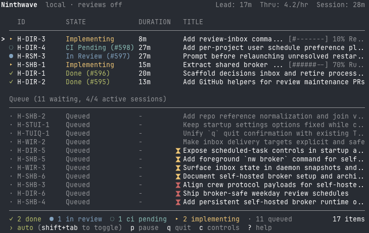

<p align="center">
  <a href="https://ninthwave.sh"></a>
</p>
<h1 align="center">Ninthwave</h1>

<p align="center">
  <strong>Decompose. Run nw. Get merged PRs.</strong>
</p>

<p align="center">
  <a href="https://github.com/ninthwave-sh/ninthwave/stargazers"></a>
  <a href="LICENSE"></a>
  <a href="CHANGELOG.md"></a>
  <a href="https://agentskills.io"></a>
</p>

<p align="center">
  <a href="https://ninthwave.sh"></a>
</p>

Ninthwave is the orchestration layer for parallel AI coding. Turn high-level plans into small, reviewable PRs while keeping your existing AI tool, billing, and local control.

## Why try Ninthwave?

- Turn a spec or plan into small, human-reviewable work items
- Run multiple native AI coding sessions in parallel, each isolated in its own worktree
- Coordinate the full delivery loop: implementer, reviewer, CI, rebase, merge
- Launch dependent work early as stacked PRs so reviewers get clean diffs
- Recover post-merge failures with a fix-forward workflow
- Share or join a crew to spread work across teammates or multiple machines
- Use the native tools directly, while Ninthwave's TUI shows live queue and pipeline status
- Stay multi-tool and no-lock-in: [Claude Code](https://docs.anthropic.com/en/docs/claude-code/overview), [OpenCode](https://opencode.ai), [Codex CLI](https://github.com/openai/codex), or [Copilot CLI](https://docs.github.com/en/copilot/how-tos/set-up/install-copilot-cli)

## How I use it

I keep planning at a high level. When a chunk of work is clear enough, I use `/decompose` to push it into the queue, leave `nw` running, and keep iterating on the plan or doing other work. When I'm confident in the breakdown, I leave Ninthwave in auto mode and it merges as checks pass. When I want a closer look, I switch to manual mode, review the PRs, and leave feedback on the PR for the agent to work through.

## How it works

`Plan -> /decompose -> parallel native sessions -> stacked PRs -> review + feedback loop -> checks -> merge`

1. Use `/decompose` to turn a spec or plan into markdown work items.
2. Run `nw` to launch parallel native sessions of your AI tool.
3. Review small PRs while the orchestrator keeps the queue moving through review, CI, and merge.

Ninthwave's orchestrator is deterministic.

For the transition states, flow diagrams, and deeper internals, see [ARCHITECTURE.md](ARCHITECTURE.md).

## Install

```bash
brew install ninthwave-sh/tap/ninthwave
```

Requires [gh](https://cli.github.com).

Interactive backends are optional: install [tmux](https://github.com/tmux/tmux/wiki) or [cmux](https://cmux.com) for attachable sessions. Ninthwave can also launch workers in headless mode.

## Quick start

1. Install Ninthwave:

   ```bash
   brew install ninthwave-sh/tap/ninthwave
   ```

2. Create work items with `/decompose` if you do not already have a queue, then run:

   ```bash
   nw
   ```

From there, Ninthwave launches the queue, opens reviewable PRs, watches checks, and keeps the pipeline moving. Leave it in auto mode when you want merges to keep flowing, or switch to manual mode when you want to review PRs and send feedback back through the loop.

## License

Apache 2.0. See [LICENSE](LICENSE).
